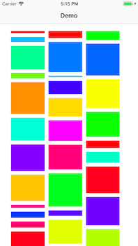

<p align="center" >
  
</p>  

SMWaterFlowLayout
===============  

<p align="left">
<a href="https://github.com/Carthage/Carthage/"></a>
<a href="https://github.com/CocoaPods/CocoaPods/"></a>
<a href="https://raw.githubusercontent.com/harryzjm/SMWaterFlowLayout/master/LICENSE"></a>
</p>


SMWaterFlowLayout is a subclass of UICollectionViewFlowLayout, easy to use.  

<p align="left" >
  
</p>  

## Requirements

- iOS 8.0+
- Xcode 9.0
- Swift 4.0

## Installation

### Carthage

[Carthage](https://github.com/Carthage/Carthage) is a decentralized dependency manager that builds your dependencies and provides you with binary frameworks.

You can install Carthage with [Homebrew](http://brew.sh/) using the following command:

```bash
$ brew update
$ brew install carthage
```

To integrate SwipeMenu into your Xcode project using Carthage, specify it in your `Cartfile`:

```swift
github "harryzjm/SMWaterFlowLayout"
```

Run `carthage` to build the framework.

### CocoaPods

[CocoaPods](http://cocoapods.org) is a dependency manager for Cocoa projects. You can install it with the following command:

```bash
$ gem install cocoapods
```

To integrate SMWaterFlowLayout into your Xcode project using CocoaPods, specify it in your `Podfile`:

```ruby
source 'https://github.com/CocoaPods/Specs.git'
platform :ios, '7.0'
use_frameworks!

target '<Your Target Name>' do
    pod 'SMWaterFlowLayout'
end
```

Then, run the following command:

```bash
$ pod install
```

#### Source File

Simply add the file in Source directory into your project.

## Usage

```swift
var lineCount: UInt  //to adjust line count
```

you must be follow `UICollectionViewDelegateFlowLayout`, to support height from

```swift
func collectionView(UICollectionView, layout: UICollectionViewLayout, sizeForItemAt: IndexPath)
```

and `lineLength`, you can easily get from `SMWaterFlowLayout.lineLength`. just look up demo.

## Communication

- If you **need help**, open an issue or send an email.
- If you **found a bug**, open an issue or send an email.
- If you'd like to **ask a question**,open an issue or send an email.
- If you **want to contribute**, submit a pull request.

## License

SMWaterFlowLayout is released under the MIT license. See LICENSE for details.

##  Author😬  

[Hares - https://github.com/harryzjm](https://github.com/harryzjm)  
Blog:  **https://harryzjm.github.io/**  
Email: **harryzjm@live.com**  
